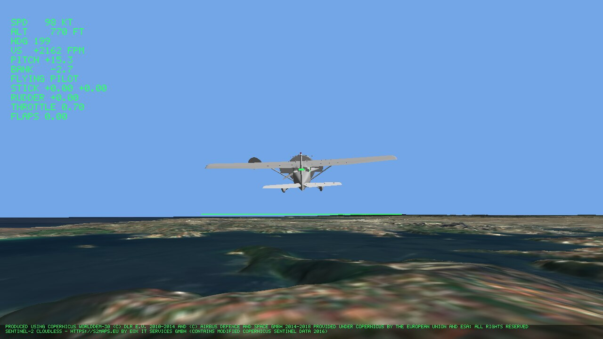
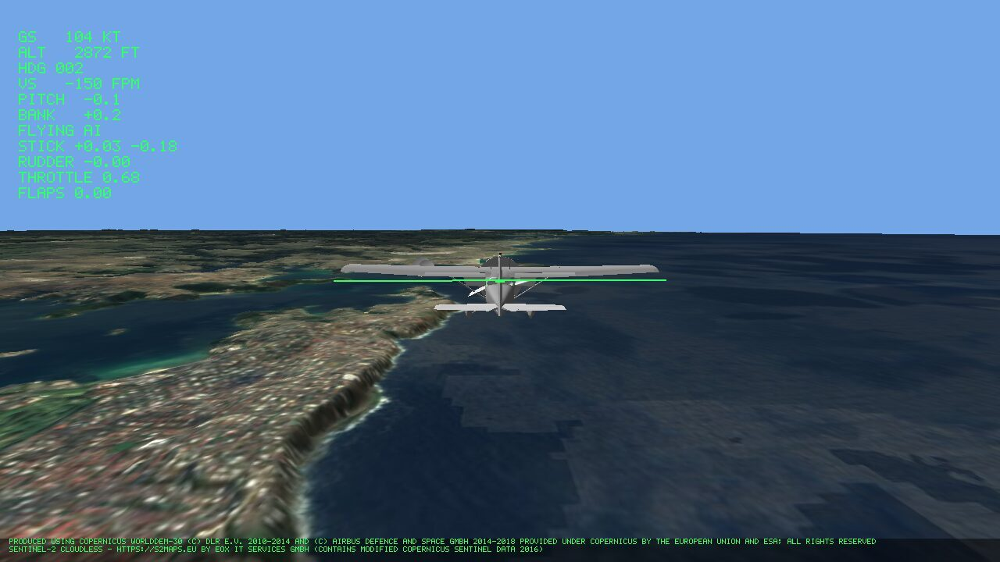
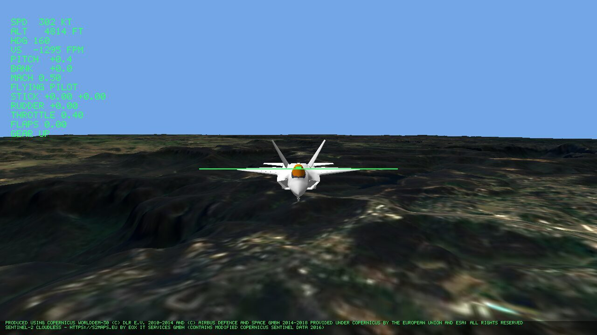
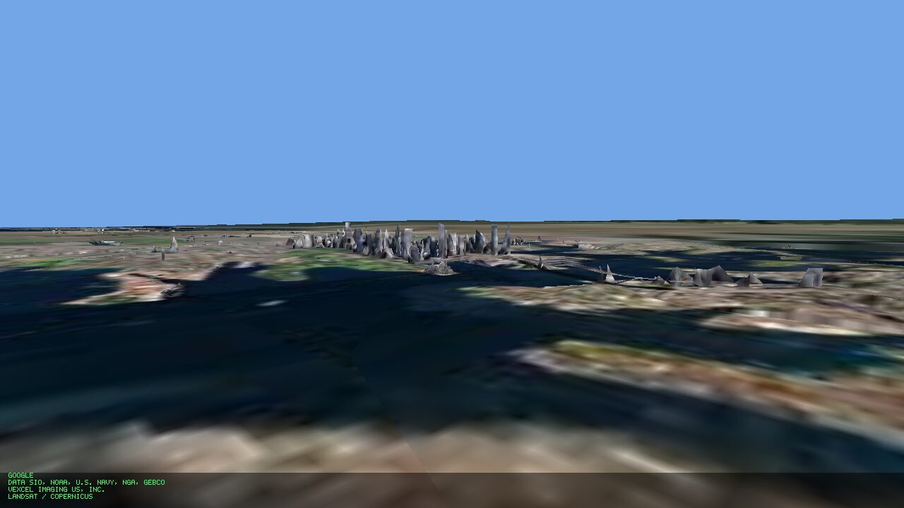
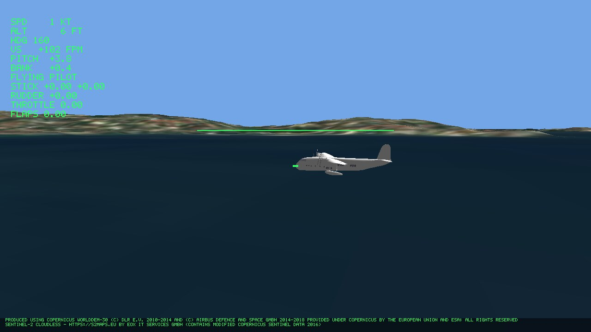
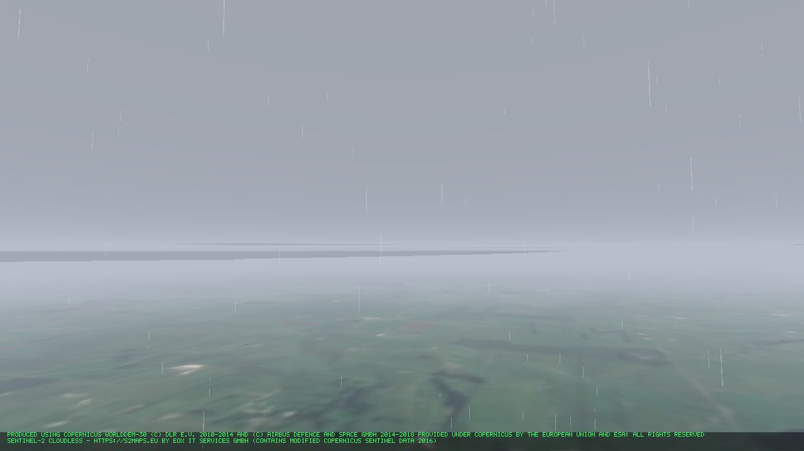
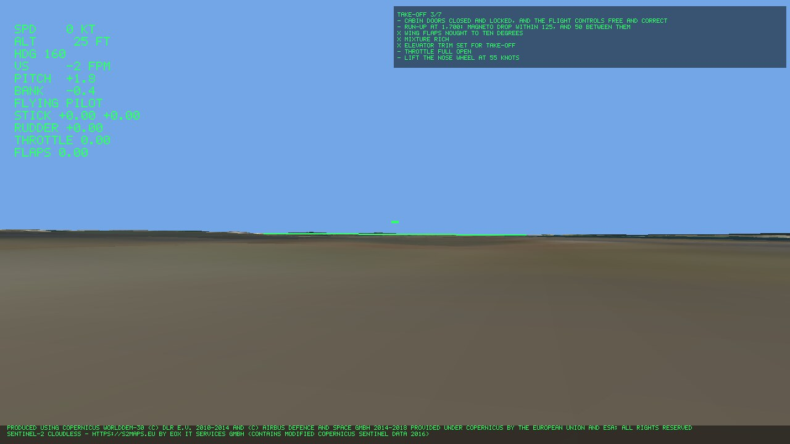
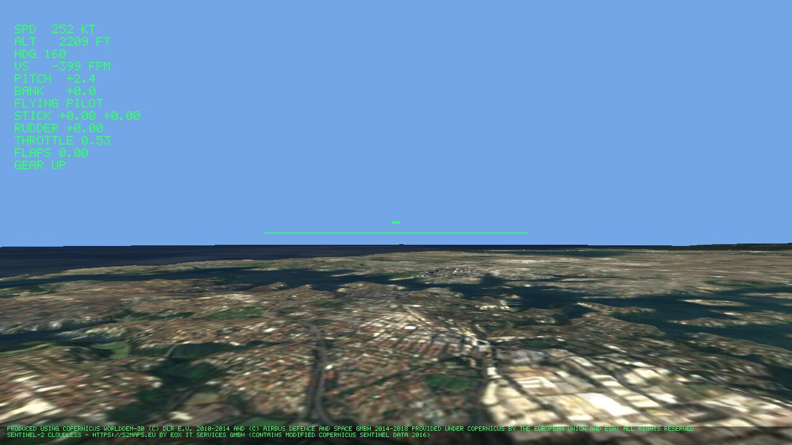
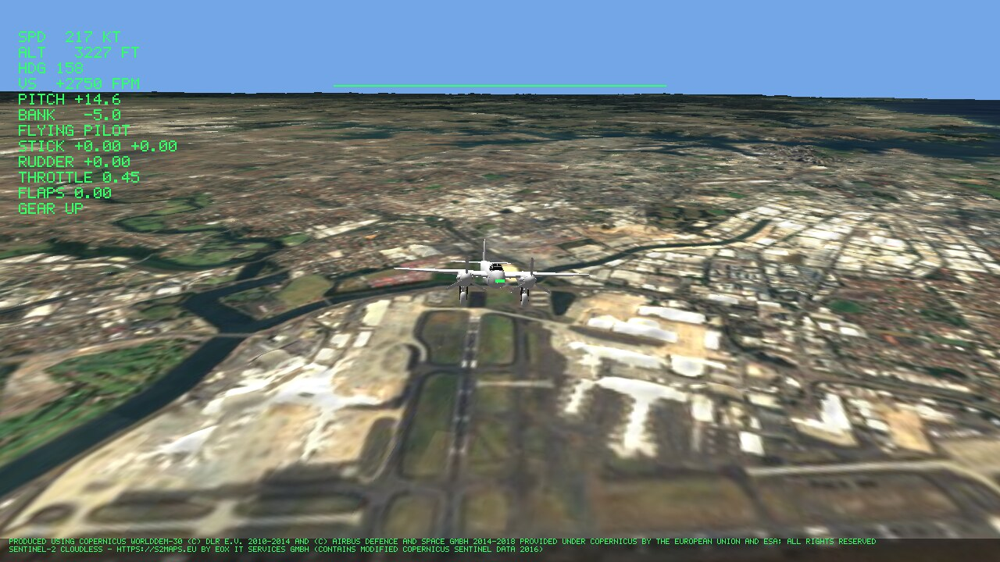
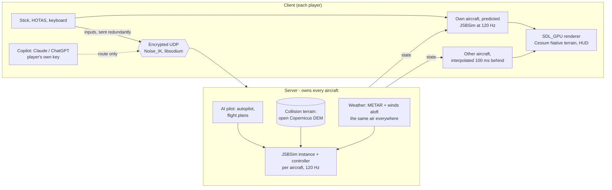

# Glideslope

**A multiplayer flight simulator over the real Earth.** Real flight dynamics
from JSBSim, flown in the wind and weather an airfield is reporting right now,
over real-world terrain streamed from the internet - and any aircraft can be
handed to an AI pilot mid-flight and taken back, without a jolt.



*A Cessna 172P climbing away from Sydney Harbour, seen from behind. The
terrain is the Copernicus DEM with Sentinel-2 imagery on it - the scenery that
needs no account. Every picture on this page is a real frame written by the
client's `--shot` option, rendered headless on Vulkan.*

- **Sixteen aircraft**, from a Piper Cub to an A380, a flying boat, a wartime
  Mosquito and four fast jets, each held by tests to its published figures.
- **Live weather.** The METAR and the winds aloft for an airfield set the wind,
  temperature and pressure; gusts, shear, turbulence, microbursts, thermals and
  mountain waves are flown; cloud, haze and rain are drawn.
- **The real Earth.** Open terrain and imagery by default, with no sign-up; or
  Cesium ion, or Google's Photorealistic 3D Tiles, with your own key.
- **Up to four players** on a server that owns every aircraft. Your own
  aircraft answers on the frame you move the stick; everyone else's moves
  smoothly.
- **AI pilots** that take over any aircraft and give it back - and a copilot
  you talk to: Claude or ChatGPT turns "take off, climb to 3,000 ft and orbit
  the CBD" into a flight plan, and the simulator's own autopilot flies it.
- **It teaches flying.** Checklists that tick themselves, and lessons for
  every class of aircraft, demonstrated by the AI pilot and ending in a
  debrief - never a score.
- **Linux, Windows and macOS**, each a download that runs where it is unpacked.

It is deliberately **not** a scored or competitive game: no leaderboards, no
replays that prove a result, no deterministic simulation.

> **Status, 2026-10-07.** Every numbered phase of the
> [completion plan](docs/COMPLETION_PLAN.md) - 95 of 95 items - is ticked,
> each against a named verification. What is left are the tails found along
> the way: 94 done, 36 open. The biggest gaps, named first: **the ground is
> drawn only around where a flight starts** (fly far enough and there is sky
> beneath you); on a server **you can ask for your aircraft as you join, but
> no test yet shows a windowed client drawing another player's choice**;
> **cloud is a flat sheet**, not a volume; the Learjet has no visual model;
> and no public server is running yet.
> [`docs/PROJECT_STATUS.md`](docs/PROJECT_STATUS.md) is the single source of
> truth.

---

## Gallery

| | |
|---|---|
|  |  |
| **On a server, riding along with the AI.** A client joined a local server and rode along in one of its four AI aircraft, flying the Sydney Harbour plan up the coast. The HUD says *FLYING AI* and shows the stick and throttle as the AI moves them; press T to take it over. | **An F-22A over the Blue Mountains**, seen from ahead. Fast jets get Mach on the HUD. |
|  |  |
| **Google's Photorealistic 3D Tiles**, with the owner's own key: Sydney's CBD across the harbour, with Google's attribution on screen. Whatever is drawn, the aircraft still meets the open DEM. | **The Short S.23 Empire flying boat afloat in Rose Bay.** Water is where the DEM's water mask puts it: the S.23 takes off from and alights on it, and a landplane ditches. |
|  |  |
| **Weather you can see.** Taranaki, New Zealand, under a METAR of 6 km visibility, light rain and broken cloud at 1,500 ft: the cloud base, haze and rain come from the report. | **Checklists that tick themselves.** The Cessna's take-off checklist, standing at Sydney airport: items the aircraft shows done are ticked (X); the rest wait to be flown, or for the pilot to confirm what the simulation cannot see. |
|  |  |
| **From the cockpit of a 737-300** at 2,200 ft over Sydney's north shore, harbour ahead. | **A Mosquito FB Mk VI**, from the free orbit camera. Its flight model was written for this project from its 1943-44 trials and Pilot's Notes. |

What the frames also show, honestly: the HUD's horizon line in them is the old
one, off the horizon drawn behind it (it has since been put on the drawn
horizon, and these frames have not been re-shot); the imagery blurs close to the ground; and the
look is a simulator's instruments over plain-shaded models - no liveries,
moving control surfaces or cockpit interiors yet.

---

## Features

Grouped as in [`docs/FEATURES.md`](docs/FEATURES.md), the menu. **Done** means
every item of the plan beneath it is ticked with its verification; **in
progress** means much of it runs and the missing part is named.

### Flying

| Feature | State |
|---|---|
| Real flight dynamics, six degrees of freedom | In progress - the 172, 182 and Cub do not reach their handbooks' ceilings; the F-15 does not stall as her manual describes; the F-35B cannot hover or land vertically |
| Wind and turbulence | **Done** |
| Wind that shears and gusts, as the report gives | **Done** |
| Live weather from the airfield's report | In progress - a flight keeps its starting airfield's weather wherever it goes |
| Thermals, ridge lift, microbursts | In progress - thermals rise over the sea as over land; no rotor or trapped waves behind a ridge |
| Weather you can see - cloud, haze, rain | In progress - cloud is a flat sheet; no storm towers; rain falls only close by |
| A choice of sixteen aircraft | In progress - on a server you can ask for an aircraft as you join and fly it, but no test yet shows a windowed client drawing another player's choice; the Learjet is not drawn |
| Joysticks, HOTAS and yokes | In progress - nothing yet opens the speedbrakes |
| A head-up display | Its horizon line now lies on the drawn horizon, held at every pitch and bank tested; the menu has not yet re-tagged it |
| Views: cockpit, ahead, behind, sides, above, free orbit | **Done** |

### The world

| Feature | State |
|---|---|
| Real terrain and imagery with no account | **Done** |
| Cesium ion scenery, with your own token | **Done** |
| Google photorealistic cities, with your own key | **Done** |
| The scenery's makers credited on screen | **Done** |
| Anywhere on Earth | In progress - the server flies anywhere; the client draws only around the start |
| Every runway in the world smooth to roll on | In progress - where runways overlap the nearest wins, and elsewhere each is held to 0.1 m of its own line; on the overlaps themselves a runway can still sit up to 0.6 m off |

### Learning to fly

| Feature | State |
|---|---|
| Checklists for every aircraft, ticking themselves | **Done** |
| Lessons - take-off, circuit, climbs, turns, stalls, landing - for each of seven classes, with a debrief | In progress - 42 lessons fly; the Learjet's take-off lesson cannot catch an early rotation |
| An instructor who demonstrates, then hands over | In progress - some stall demonstrations lose more height than the lesson allows |

### AI pilots

| Feature | State |
|---|---|
| An autopilot: heading, altitude, airspeed, climb rate | **Done** |
| Flight plans: routes of waypoints | **Done** |
| See who is flying, and the controls as they move | **Done** |
| Hand over the controls and take them back | In progress - in the windowed client, A pressed during a take-over can hand over the wrong aircraft |
| Ride along in an AI aircraft, then take it over | In progress - one unexplained take-over in testing was not refused |
| AI traffic that keeps flying with nobody connected | In progress - nothing yet stops you flying into an AI aircraft |
| A copilot you talk to, and a different model on each AI aircraft | In progress - Claude and ChatGPT plan routes and change them as the flight goes, and the autopilot flies them; the AI knows no runway for a landing flown by hand |

### Flying together

| Feature | State |
|---|---|
| Up to four players | In progress - four machines have flown together; one old fault not yet shown gone on Windows; joining again no longer goes back to a dead session |
| The same air for everyone | In progress - on a server the air does not yet rise over hills |
| Controls that answer immediately (prediction) | In progress - the windowed client does not yet smooth the server's corrections; a client is held to its send rates and predicts a stopped engine |
| Crashes cost a flight, not the session | **Done** |
| Leaving does not crash the aircraft | **Done** |
| Run your own server - terminal dashboard, or a window | **Done** |
| A public server to join | Not yet - none is running |

### The platform

| Feature | State |
|---|---|
| Linux (both families), Windows x64, Apple-silicon macOS | **Done** |
| One download per platform that runs in place | **Done** |
| A signed, notarised Mac download; one Linux download for every distribution | Not yet |

---

## The aircraft

Each is a JSBSim flight model held by tests to published figures before it is
offered. Where JSBSim had no model, one was written for this project from the
published documents, every number cited. Visual models are FlightGear's, each
licence checked.

| Aircraft | Class | Notable |
|---|---|---|
| Piper J-3 Cub | Light aircraft | The slowest in the hangar; flies to its handbook |
| Cessna 172P Skyhawk | Light aircraft | The reference aircraft: nine handbook figures, the selftest, and a landing learnt by reinforcement learning |
| Piper PA-28-180 Cherokee | Light aircraft | Flies to its handbook |
| Cessna 182S Skylane | Light aircraft | Flies to its handbook |
| Short S.23 Empire | Flying boat | Takes off from and alights on the sea and lakes; held to *Flight*'s figures of 1936 |
| de Havilland Mosquito FB Mk VI | Second World War | Written here from its 1943-44 A&AEE trials and Pilot's Notes; fourteen figures |
| Gates Learjet 35A | Business jet | Written here from its flight manual and NASA's Learjet 23 measurements; no visual model exists to draw |
| Airbus A320 | Airliner | Airport-planning document and type certificate |
| Boeing 737-300 | Airliner | Airport-planning document and type certificate |
| Boeing 747-400 | Airliner | Airport-planning document and type certificate |
| Boeing 787-8 | Airliner | Airport-planning document and type certificate |
| Airbus A380-841 | Airliner | Written here from Airbus's and the certifying authorities' documents |
| McDonnell Douglas F-15C Eagle | Fighter | Held to the Air Force's figures: Mach, climb, ceiling, turn rate |
| Lockheed Martin F-22A Raptor | Fighter | Held to the Department of Defense's figures |
| Lockheed Martin F-35B Lightning II | Fighter | Written here from what is published; the lift fan is not modelled, so no STOVL is claimed |
| Northrop Grumman B-2A Spirit | Bomber | Written here from what is published, and no more |

```sh
glideslope_cli aircraft            # list them
glideslope_cli figures mosquito-fb6  # fly one's published figures, and check each
```

---

## How it works



- **The simulation steps at a fixed 120 Hz; the picture does not.** Frames
  interpolate between physics states, so how an aircraft flies does not
  depend on the frame rate. The simulation links nothing that draws, reads a device or plays sound,
  and the build refuses it if it tries.
- **The server owns every aircraft.** An aircraft is a JSBSim instance plus a
  controller, and a controller is either a person's input or an AI pilot - so
  handing an aircraft to the AI, or taking one over, is a controller swap and
  nothing more. Clients send inputs, never state.
- **Prediction and reconciliation.** Each client flies its own aircraft ahead
  of the server and reconciles against it; other aircraft are drawn 100 ms in
  the past. JSBSim is floating point and machines differ, so the drift is
  measured and bounded, not treated as a bug - held within its bounds at
  100 and 200 ms of latency with jitter and loss.
- **One ground for everyone.** Collision is always the open Copernicus DEM at a
  pinned version, with every runway's own surface laid into it, never the mesh
  being drawn - so the server and every client agree on where the ground is,
  whether you are looking at open data, Cesium ion or Google. How far the drawn
  terrain sits from it is measured per provider, not assumed.
- **Double precision, Earth-centred.** World positions are 64-bit ECEF; floats
  exist only relative to the camera, at a floating origin, with reversed-Z
  depth.
- **The transport** is `Noise_IK_25519_ChaChaPoly_BLAKE2b` over UDP with
  libsodium, inherited from the author's earlier racing game, *gearstick*, under
  its own magic value - and written up byte for byte in
  [`docs/TRANSPORT.md`](docs/TRANSPORT.md), including what it does not claim,
  so a third party can write a client from the document alone (a test does).
  Every parser is fuzzed; every message the server accepts is named with its
  defence in [`docs/THREATS.md`](docs/THREATS.md).
- **The LLM plans; the controllers fly.** A language model can produce only a
  flight plan and autopilot modes, checked by the build - what the copilot's
  code can see, open and link. Nothing a model says reaches a control surface
  any other way. The player's key stays on the player's machine; the server
  receives only the route, checks it, and flies it.

---

## The scale of it

Figures taken from the repository on **2026-10-07**, at `origin/main`
(`2912f34`). The first commit was on 2026-09-17.

| | |
|---|---|
| Commits on `main` | **570** (`git rev-list --count`) |
| Pull requests merged | **109** (`gh pr list --state merged`) |
| First-party code | **~126,000 lines**: `src/` 51,300, `tests/` 64,100, `tools/` 10,500 (`wc -l` of tracked source; `ext/` excluded) |
| Tests | **about 930** registered with ctest (803 by `ctest -N` at the last full count, plus the glide, rate-limit, rejoin, aircraft-choice and horizon tests since, counted from the CMake lists): 68 unit-test files, 109 scripted end-to-end scenarios (rendered frames read back, servers and clients in separate processes, packages unpacked and run) |
| Completion plan | **95 of 95** phase items ticked across 12 phases; **94** tails done, **36** open; 12 items set aside for later (`docs/COMPLETION_PLAN.md`) |
| CI, on every pull request | Ubuntu (debug, release), Rocky Linux 9, macOS 15 (debug, release), Windows (MSVC debug and release, clang-cl) - plus cross-platform flight agreement, the server's container image, and packages run in stock containers. A nightly run repeats the multi-process tests |
| Living documents | ~26,000 lines across `docs/`, of which `PROJECT_STATUS.md` alone is ~20,000 |
| Aircraft, lessons | 16 aircraft, 15 drawn; a checklist for each, nine phases of flight; 42 lessons across 7 classes |

Some of the discipline behind those numbers (see [`CLAUDE.md`](CLAUDE.md)):
warnings are errors in every build type, `-Wconversion` included; tests are
named as sentences stating the fact they pin; a test nobody has seen fail is
not trusted, so a check is broken on purpose and seen to fail before it is
believed; `glideslope_cli selftest`
flies a fixed five-minute input log and prints a state hash that must not move.

---

## Getting started

```sh
git clone --recurse-submodules https://github.com/GavinMGlynn/glideslope.git
cd glideslope
cmake --preset linux-release      # or linux-debug, macos-*, windows-*
cmake --build --preset linux-release
ctest --preset linux-release
cpack --preset linux-release      # a package; macos-release, windows-release
```

The first configure builds Cesium Native's dependencies through vcpkg: most of
an hour, once, then cached. On Linux it needs Perl's `IPC::Cmd`, NASM, make,
autoconf, autoconf-archive, automake and libtool. In WSL, cap the parallelism
(`cmake --build --preset linux-debug -j8`).

**Fly:**

```sh
glideslope                                   # the Cessna, over Sydney airport
glideslope --weather YSSY                    # in Sydney airport's weather, now
glideslope --aircraft f22 --view behind      # the F-22, from outside (V cycles views)
glideslope --aircraft short_s23 --on-ground --at -33.866,151.262,0
                                             # the flying boat, afloat in Rose Bay
glideslope --plan sydney-harbour             # the AI flies a tour of the harbour
glideslope --checklist take-off --on-ground --at -33.9461,151.1772,0
glideslope --terrain google                  # Google's 3D Tiles (needs a key)
```

In flight, **A** hands the aircraft to the AI and takes it back, **V** steps
through the views, and **M** chooses which model plans for your aircraft once
it is handed over.

**Fly together:**

```sh
glideslope_server                            # prints its public key; dashboard in the terminal
glideslope_server --window                   # or in a window; --headless for neither
glideslope --server HOST 47801 --server-key KEY
glideslope --server HOST 47801 --server-key KEY --ride-along
                                             # ride in an AI aircraft; T takes it over
```

A server runs four AI aircraft by default (`--ai N`) for up to four players
(`--players N`). `deploy/` holds a systemd unit and a Dockerfile.

**The command line,** with nothing presentational linked:

```sh
glideslope_cli selftest                      # a five-minute flight, and its hash
glideslope_cli figures c172p                 # fly the Cessna's handbook figures
glideslope_cli height -33.9461 151.1772      # the ground's height, from the DEM
glideslope_cli weather YSSY                  # the METAR and winds aloft now
glideslope_cli land c172p --learnt --crosswind 10
                                             # the learnt landing, in a crosswind
```

### Keys are optional, and yours

Everything above works with no account. To use the commercial scenery or a
language model, put **your own** key in a file in glideslope's config
directory - `~/.config/glideslope/` on Linux, `~/Library/Application
Support/glideslope/` on macOS, `%APPDATA%\glideslope\` on Windows - or in the
environment variable beside it:

| File | Environment | For |
|---|---|---|
| `cesium-ion-token` | `GLIDESLOPE_CESIUM_ION_TOKEN` | Cesium ion terrain and imagery (and Google's tiles through ion) |
| `google-maps-key` | `GLIDESLOPE_GOOGLE_MAPS_KEY` | Google Photorealistic 3D Tiles |
| `anthropic-key` | `GLIDESLOPE_ANTHROPIC_KEY` | Claude as copilot or planner |
| `openai-key` | `GLIDESLOPE_OPENAI_KEY` | ChatGPT as copilot or planner |

No key or token ships with the simulator, and none is ever in this repository.
Tests that need one report themselves skipped without it - and CI replays the
models' recorded answers, so the copilot is tested with no key at all.

---

## The documents

- [`docs/REQUIREMENTS.md`](docs/REQUIREMENTS.md) - the design, and every
  decision made about it, closed and open.
- [`docs/FEATURES.md`](docs/FEATURES.md) - the menu, at the altitude of "what
  would the player notice", including what is deliberately left out.
- [`docs/COMPLETION_PLAN.md`](docs/COMPLETION_PLAN.md) - the road to done, in
  phases, each item with its verification.
- [`docs/PROJECT_STATUS.md`](docs/PROJECT_STATUS.md) - what works today, the
  gaps named first, and the log of how it got there.
- [`docs/TRANSPORT.md`](docs/TRANSPORT.md) - the wire protocol, byte for byte.
- [`docs/THREATS.md`](docs/THREATS.md) - every message the server accepts, and
  its defence.
- [`docs/ASSETS.md`](docs/ASSETS.md) - where every piece of third-party data
  comes from, and its terms.

---

## Credits and data

- **Flight dynamics:** [JSBSim](https://github.com/JSBSim-Team/jsbsim), LGPL-2.1;
  the models derived from it remain under its licence.
- **Visual models:** [FlightGear](https://www.flightgear.org/)'s aircraft, each
  licence recorded in [`docs/ASSETS.md`](docs/ASSETS.md).
- **Terrain streaming and rendering:** [Cesium Native](https://github.com/CesiumGS/cesium-native),
  Apache-2.0; windowing, input and GPU through [SDL3](https://libsdl.org/).
- **Elevation and collision terrain:** produced using Copernicus WorldDEM-30 ©
  DLR e.V. 2010-2014 and © Airbus Defence and Space GmbH 2014-2018 provided
  under COPERNICUS by the European Union and ESA; all rights reserved. The
  organisations in charge of the Copernicus programme by law or by delegation
  do not incur any liability for any use of the Copernicus WorldDEM-30.
- **Geoid:** EGM2008, through GeographicLib's grid.
- **Imagery:** Sentinel-2 cloudless - <https://s2maps.eu> by EOX IT Services
  GmbH (Contains modified Copernicus Sentinel data 2016), under CC BY 4.0.
- **Runways:** [OurAirports](https://ourairports.com/data/).
- **Weather:** METARs from aviationweather.gov, NOAA's Aviation Weather Center;
  winds aloft by [Open-Meteo.com](https://open-meteo.com/), under CC BY 4.0.
- **Optional scenery:** Cesium ion and Google Photorealistic 3D Tiles, under
  their providers' terms with the user's own key; their attribution is drawn on
  screen whenever they are.
- **Copilot:** Anthropic's Claude and OpenAI's ChatGPT, with the user's own key.

Every source's terms are in [`docs/ASSETS.md`](docs/ASSETS.md), and every
linked library's licence ships in `licenses/` in a package.

## Licence

GPL-3.0-or-later. See [LICENSE](LICENSE). Third-party data - terrain, imagery,
weather and aircraft models - is under its own terms, recorded in
[`docs/ASSETS.md`](docs/ASSETS.md).
